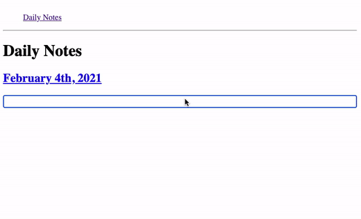

# Roam-clone


a RoamResearch clone built with React and Dgraph with the following minimal set of functionality.

- Adding notes, obviously.
- Adding links to pages using `[[` or `#`
- Embedding blocks using `((`
- Ability to find references for a page.
- keyboard navigation.
- Saved to Dgraph graph based database.

## Prerequisites
Node (We recommend using v12.6.0 or higher)

Docker

## Getting Started

1- Clone repo and install node dependencies
```
$ git clone https://github.com/amine-benselim/roam-clone
$ cd roam-clone
$ yarn
```

2- Start Dgraph
```
$ docker run -it -p 6080:6080 -p 8080:8080 -p 9080:9080 -p 8000:8000 -v \
/mnt/dgraph:/dgraph dgraph/standalone:v20.03.0
```
3- Launch Ratel UI
```
http://localhost:8000/
```

3- Deploy Schema to Dgraph following the intstructions in the screenshot
```
<Node.children>: [uid] .
<Node.parent>: uid @reverse .
<Node.position>: int .
<Node.referencedBy>: [uid] .
<Node.references>: [uid] @reverse .
<Node.title>: string @index(exact, trigram) .
<Node.value>: string @index(exact, trigram) .
<dgraph.graphql.schema>: string .
type <Node> {
    Node.title
    Node.value
    Node.position
    Node.parent
    Node.children
    Node.references
    Node.referencedBy
}
type <dgraph.graphql> {
    dgraph.graphql.schema
}
```


4- Start the frontend 🎉
```
$ yarn start
```
